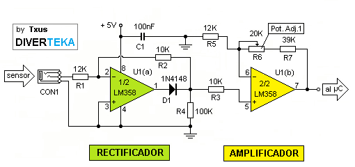

# Sensors
## Electricity Current
A clamp meter `SCT-013` which can measure max. 30A, you will need to buy `LM358` if you work with Arduino or `ESP32`.

[[Go back]](/sensors)

### Hardware
- ESP32
- [SCT-013-30](../docs/SCT-013-30.pdf) - [MCIelectronic Source](https://www.mcielectronics.cl/website_MCI/static/documents/Datasheet_SCT013.pdf)
- [LM358](../docs/LM358.pdf) - [TexasInstruments Source](http://www.ti.com/lit/ds/symlink/lm358-n.pdf)

### [Code](SCT-013-30.ino) 
```cpp
#define SCT013 34

void setup() {
  Serial.begin(9600);
}

void loop() {
  delay(3000);
  float Tension = 225.00;
  float Irms = readEnergyConsumption();  // Corriente eficaz (A)
  float P = Irms * Tension;  // P=IV (Watts)
  Serial.print("Irms: ");
  Serial.print(Irms, 3);
  Serial.print("A, Potencia: ");
  Serial.print(P, 3);
  Serial.println("W");
}

float readEnergyConsumption() {
  float sensorVoltage;
  float current = 0;
  float sumatory = 0;
  long time = millis();
  int N = 0;

  while (millis() - time < 500) {  // Duración 0.5 segundos (Aprox. 25 ciclos de 50Hz)
    sensorVoltage = (analogRead(34) * (3.3 / 4095.0)) / 8;  //voltaje del sensor
    current = sensorVoltage * 25.5;  // current = sensorVoltage * (20A / 1V)
    sumatory = sumatory + sq(current);  // sumatory of square roots
    N = N + 1;
    delay(1);
  }
  sumatory = sumatory * 2;  // Para compensar los cuadrados de los semiciclos negativos
  current = sqrt((sumatory) / N);  // ecuación del RMS
  return current;
}
```

### Libraries
- _SoftwareSerial_ by Peter Lerup and Dirk Kaar [GitHub](https://github.com/plerup/espsoftwareserial/) - Installed from GitHub


### Connection




[[Go back]](/sensors)
