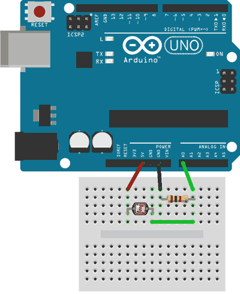

# Sensor
## Fotoresistor
Using the foto-reisitor to measure luminosity.

### Hardware
* ESP32
* [Foto-resistor](docs/datasheet_fotoresistor.pdf) - [KTH Source](https://www.kth.se/social/files/54ef17dbf27654753f437c56/GL5537.pdf)

### Code
* [foto-resistor.ino](foto-resistor.ino)
```cpp
#define DARKNESS_RES  1000  // Resistance in darkness in KΩ
#define BRIGHTNESS_RES  15  // Resistance in brightness (10 Lux) in KΩ
#define CALIBRARION_RES 10  // Calibration resistance in KΩ
#define LDR_PIN         33  // LDR Pin

#define ANALOG_BIT_RESOLUTION 12.0

int voltage_measure;
int lux_measure;
 
void setup(){
   Serial.begin(9600);
   analogReadResolution(ANALOG_BIT_RESOLUTION);  // Sets the reading resolution value to 12 bits (0-4095)
}
 
void loop(){
   voltage_measure = analogRead(LDR_PIN);  // Reads the value from the pin in a 0-4095 resolution corresponding to a linear 0-3.3V        
 
   lux_measure = voltage_measure*DARKNESS_RES*10/(BRIGHTNESS_RES*CALIBRARION_RES*(pow(2.0, ANALOG_BIT_RESOLUTION)-voltage_measure));  // Use with LDR & Vcc 
   
   Serial.println("Measure: " + String(lux_measure) + " lux");   
   
   delay(1000);  // Check the button every 1000 miliseconds
}
```

### Libraries
* No needed libraries

### Connection

