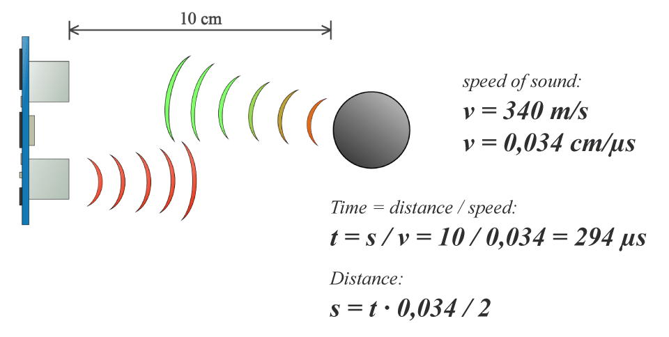

# Sensor
## Fotoresistor
Using the foto-reisitor to measure luminosity.

### Hardware
* ESP32
* [Ultrasounds](docs/datasheet_fotoresistor.pdf) - [ELECFreaks](https://cdn.sparkfun.com/datasheets/Sensors/Proximity/HCSR04.pdf)

### Code
* [ultrasounds.ino](ultrasounds.ino)
```cpp
#define ECHO_PIN  34  //Analog input that receives the echo signal
#define TRIG_PIN  33 //Digital output that sends the trigger signal

unsigned long duration;
unsigned int distance;

void setup() {
  pinMode(ECHO_PIN, INPUT); // Sets the ECHO_PIN as an Input
  pinMode(TRIG_PIN, OUTPUT); // Sets the TRIG_PIN as an Output
  Serial.begin(9600); // Starts the serial communication

}

int getDistance() {
  digitalWrite(TRIG_PIN, LOW); // Clears the TRIG_PIN
  delayMicroseconds(2);
  digitalWrite(TRIG_PIN, HIGH);// Sets the TRIG_PIN on HIGH state for 10 micro seconds
  delayMicroseconds(10);
  digitalWrite(TRIG_PIN, LOW);
  duration = pulseIn(ECHO_PIN, HIGH); // Waits for the ECHO_PIN to go from LOW to HIGH, 
                                      //starts timing, then waits for the pin to go LOW and stops timing (in microseconds).
  distance = duration * 0,034/2; //Calculation of the distance can be found in docs/distance_calculation.png
  Serial.println("Distance to the object: ");
  Serial.print(distance);
  Serial.print("cm");
  
}

void loop() {
  getDistance();
  delay(1000);
}
```

### Libraries
* No needed libraries

### Distance Calculation

